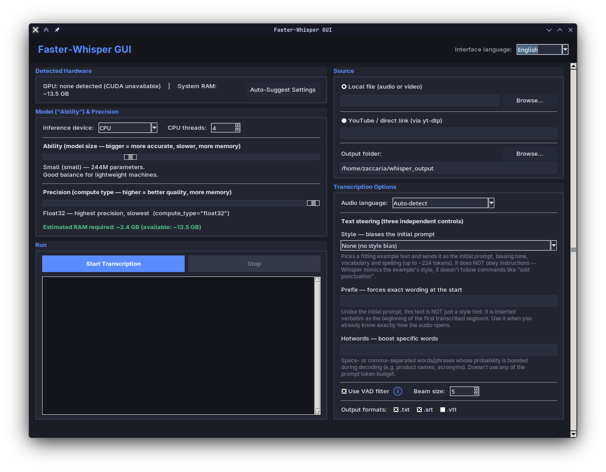

# Whisper GUI

A self-contained desktop app for transcribing audio/video with [faster-whisper](https://github.com/SYSTRAN/faster-whisper). 

The UI was built entirely on Python's standard library UI toolkit to reduce dependencies.

The script manages its own dependencies in a Venv.

## Preview



## Requirements

- Python 3.9+ with **Tk/tkinter** available.
  - Debian/Ubuntu: `sudo apt install python3-tk`
  - Fedora: `sudo dnf install python3-tkinter`
  - Arch: `sudo pacman -S tk`
  - macOS (Homebrew): `brew install python-tk`
  - Windows: included with the standard python.org installer
- Internet access on first run, to install dependencies and (optionally) download a `ffmpeg` build in the PATH. Otherwise, the script downloads its own `static-ffmpeg` binary.

Everything else is downloaded and installed on-the-run.

## Running

```
git clone https://github.com/Zac06/whisper-gui.git
cd whisper-gui
python3 whisper.py
```

The first run might be slow for dependency installation, the next ones will be faster.

### Flags

| Flag | What it does |
|---|---|
| `--with-torch` | Also installs PyTorch inside the venv, purely to improve GPU/VRAM detection. Not required — `nvidia-smi` is used as a fallback. |
| `--reinstall-deps` | Forces a fresh `pip install` of all dependencies even if they already look installed. |
| `--reset-venv` | Deletes and recreates the virtual environment from scratch. |


## Instructions

1. **Detected Hardware** panel shows your GPU (if any) and system RAM. Click **Auto-Suggest Settings** to have it pick a model size and precision that should fit your machine.
2. **Model & Precision** — two sliders:
   - *Ability* = model size (tiny → large-v3). Bigger = more accurate, slower, more memory.
   - *Precision* = compute type (int8 → float32). Higher = better quality, more memory.
   - A live memory estimate updates as you move either slider, and warns if it's likely to exceed what's available.
3. **Source** — either a local audio/video file, or a YouTube/direct URL (downloaded via `yt-dlp`).
4. **Transcription Options**:
   - **Language** — pick one, or leave on auto-detect.
   - **Style** — biases *tone/vocabulary/spelling* by sending a short example text as the model's initial prompt. Pick a preset (formal, casual, podcast, etc.) or write your own under "Custom." Note: this does **not** obey instructions — Whisper mimics the example's style, it doesn't follow commands like "add punctuation."
   - **Prefix** — forces exact wording at the very start of the transcript. Use this only if you already know how the audio opens.
   - **Hotwords** — space/comma-separated words or phrases to boost during decoding (product names, acronyms, etc.), at no cost to prompt budget.
   - **VAD filter** — skips silent/noise-only stretches before transcribing (faster, fewer hallucinated phrases). Hover the "i" icon for details.
5. Choose your output formats (`.txt`, `.srt`, `.vtt`) and an output folder.
6. Click **Start Transcription**. If you gave a URL, it downloads first, then transcribes automatically.


## Language

The default language is **Italian**. You can change it in the top right dropdown.

## Output

The output files will be generated after the filename of the media file you selected for transcription, in whichever format you specified before running.
The files will be generated into the specified output folder.

